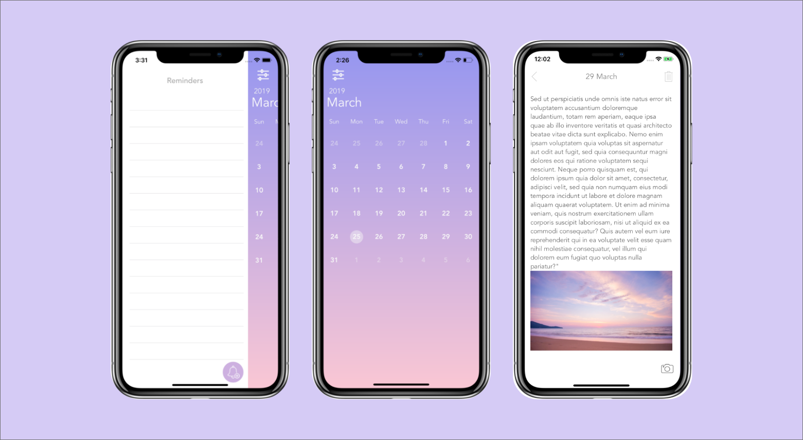
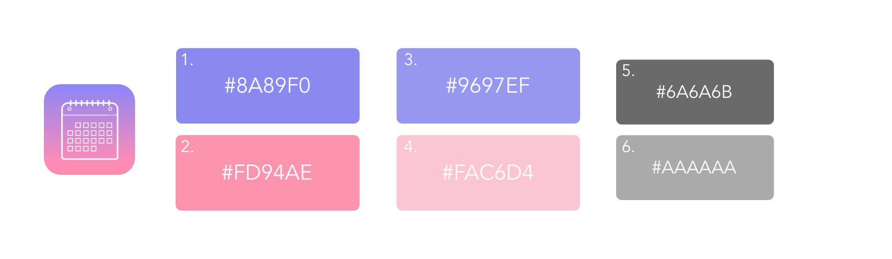

# Note

*iOS app for diary taking. Users are open up to a calendar and can click on each individual day to take notes; including text and images. Users can create reminders that are assigned to chosen date.*

## Screen Casts

## Color Scheme

1. Purple App Color: #8A89F0
2. Pink App Color: #FD94AE
3. Purple background color gradients: #9697EF
4. Pink background color gradients: #FAC6D4
5. Main text color: #6A6A6B
6. Lighter text color: #AAAAAA

## Technologies used
*Core Data, JTAppleCalendar Library*

#### Core Data
The app uses Core Data framework as persistent data. Storing text, images, and reminders within each date stored under the Note entity with a one to many relationship with the Notification entity.

#### JTAppleCalendar
The app integrates JTAppleCalendar library by installing CocoaPods. JTAppleCalendar allows cutomizable calendars. Read more on their [GitHub](https://github.com/patchthecode/JTAppleCalendar)

---
### Contact Me
**Rinni Swift** *iOS Developer, UI and UX designer*\
Check my [GitHub profile](https://github.com/RinniSwift)\
Connect with me on [LinkedIn](https://www.linkedin.com/in/rinni-swift-07b6b8169/)\
Check my [Portfolio](https://www.makeschool.com/portfolio/RinniSwift)
